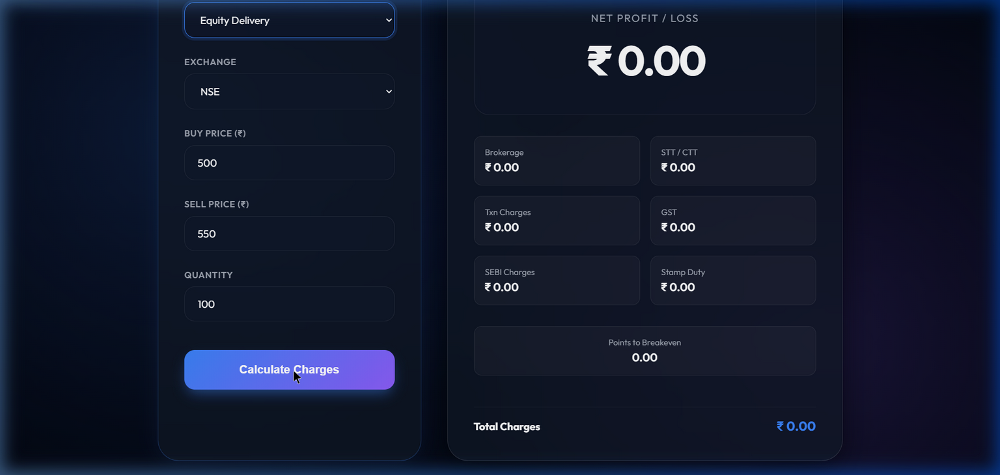

# 📊 Zerodha Brokerage Calculator

[](https://choosealicense.com/licenses/mit/)
[](https://www.python.org/)
[](https://badge.fury.io/py/zerodha-brokerage-calculator)

A powerful Python package that simplifies the calculation of Zerodha brokerage charges across various trading segments including equities, commodities, and currencies. Built with precision and ease of use in mind.





## 🌟 Features

- ✨ **Comprehensive Coverage**: Support for multiple trading segments
- 🚀 **Easy Integration**: Simple API for quick implementation
- 💯 **Accurate Calculations**: Precise brokerage and charges computation
- 🔄 **Real-time Updates**: Always current with latest Zerodha charges

## 📦 Installation

Get started with a simple pip install:

```bash
pip install zerodha-brokerage-calculator
```

## 🌐 Web Application

The project now includes a premium web-based frontend. To run it locally:

1. **Install Flask**:
   ```bash
   pip install flask
   ```

2. **Run the server**:
   ```bash
   python app.py
   ```

3. **Open in browser**:
   Navigate to `http://127.0.0.1:5000` to use the interactive calculator.

## 🚀 Quick Start

Here's a quick example to calculate equity intraday charges:

```python
from zerodha_brokerage_calculator import calculate_equity_intraday

# Calculate charges for an intraday equity trade
result = calculate_equity_intraday(
    buy_price=1000,
    sell_price=1100,
    quantity=400,
    exchange='NSE'
)

print(f"Net Profit: ₹{result['net_profit']:,.2f}")
print(f"Total Charges: ₹{result['total_charges']:,.2f}")
```

## 📘 Available Functions

### 📈 Equity Trading
| Function | Description |
|----------|-------------|
| `calculate_equity_intraday()` | Calculate intraday trading charges |
| `calculate_equity_delivery()` | Calculate delivery trading charges |
| `calculate_equity_futures()` | Calculate futures trading charges |
| `calculate_equity_options()` | Calculate options trading charges |

### 💱 Currency Trading
| Function | Description |
|----------|-------------|
| `calculate_currency_futures()` | Calculate currency futures charges |
| `calculate_currency_options()` | Calculate currency options charges |

### 🏭 Commodities Trading
| Function | Description |
|----------|-------------|
| `calculate_commodity_futures()` | Calculate commodity futures charges |
| `calculate_commodity_options()` | Calculate commodity options charges |

## 📊 Function Parameters

| Parameter | Description | Type |
|-----------|-------------|------|
| `buy_price` | Purchase price of the asset | float |
| `sell_price` | Selling price of the asset | float |
| `quantity` | Number of units traded | int |
| `exchange` | Trading exchange (NSE/BSE/MCX) | str |
| `multiplier` | Contract size multiplier (for commodities) | float |

## 📋 Return Values

Each function returns a comprehensive dictionary containing:

```python
{
    'turnover': float,          # Total transaction value
    'brokerage': float,         # Brokerage charges
    'stt': float,              # Securities Transaction Tax
    'exchange_txn_charges': float,  # Exchange transaction charges
    'sebi_charges': float,      # SEBI charges
    'gst': float,              # Goods and Services Tax
    'stamp_duty': float,        # Stamp duty charges
    'total_charges': float,     # Sum of all charges
    'gross_profit': float,      # Profit before charges
    'net_profit': float,        # Profit after charges
    'points_to_breakeven': float # Required points for breakeven
}
```

## 📁 Package Structure

```
zerodha_brokerage_calculator/
├── zerodha_brokerage_calculator/
│   ├── __init__.py
│   └── calculator.py
├── README.md
├── setup.py
└── LICENSE
```

## 📘 Detailed API Reference

### Core Functions

#### `calculate_equity_intraday(buy_price, sell_price, quantity, exchange)`
Calculates charges for equity intraday trading where buy and sell happen on the same day.
- **Brokerage**: 0.03% or Rs. 20 per executed order (whichever is lower).
- **STT/CTT**: 0.025% on the sell side.
- **Transaction Charges**: NSE: 0.00325% | BSE: 0.00375%.

#### `calculate_equity_delivery(buy_price, sell_price, quantity, exchange)`
Calculates charges for equity delivery where shares are held for more than one day.
- **Brokerage**: Free (Rs. 0).
- **STT/CTT**: 0.1% on both buy and sell sides.
- **Transaction Charges**: 0.00325% on both sides.

---

## 📊 Tax and Charge Structure

| Charge Type | Equity Intraday | Equity Delivery | Equity Futures | Equity Options |
| :--- | :--- | :--- | :--- | :--- |
| **Brokerage** | 0.03% or ₹20 | ₹0 | 0.03% or ₹20 | Flat ₹20 |
| **STT** | 0.025% (Sell) | 0.1% (Both) | 0.0125% (Sell) | 0.0625% (Sell) |
| **Transaction** | 0.00325% | 0.00325% | 0.0019% | 0.053% (on Premium) |
| **GST** | 18% on (B+T) | 18% on (B+T) | 18% on (B+T) | 18% on (B+T) |
| **SEBI Fees** | ₹10 / Crore | ₹10 / Crore | ₹10 / Crore | ₹10 / Crore |
| **Stamp Duty** | 0.003% (Buy) | 0.015% (Buy) | 0.002% (Buy) | 0.003% (Buy) |

---

## 🛠️ Advanced Usage & Integration

### Customizing Multipliers for Commodities
For commodities, the `multiplier` parameter is crucial as it represents the contract size.

```python
# Gold Mini (100 grams)
result = calculate_commodity_futures(
    buy_price=48000, 
    sell_price=48500, 
    quantity=1, 
    multiplier=100, 
    exchange='MCX'
)
```

### Batch Processing Trades
You can easily use this library to process a list of trades from a CSV:

```python
import csv
from zerodha_brokerage_calculator import calculate_equity_delivery

with open('my_trades.csv', mode='r') as file:
    reader = csv.DictReader(file)
    total_net_profit = 0
    for row in reader:
        res = calculate_equity_delivery(
            float(row['buy']), 
            float(row['sell']), 
            int(row['qty']), 
            'NSE'
        )
        total_net_profit += res['net_profit']
    
print(f"Total Portfolio Net Profit: ₹{total_net_profit}")
```

---

## ❓ Frequently Asked Questions

### 1. Why is the net profit different from my manual calculation?
Most manual calculations forget to include **GST** (which is 18% on the sum of Brokerage and Transaction charges) or **Stamp Duty** (which varies by buy/sell state, though standard rates are used here).

### 2. Is this library up to date with 2024 tax rates?
Yes, the constants in `calculator.py` are updated to reflect the latest SEBI and exchange charges as of early 2024.

### 3. Does this support MCX options?
Yes, use the `calculate_commodity_options` function.

---

## 🤝 Contributing

We welcome contributions! Please follow these steps:

1. **Fork the Repository**: Create your own copy of the project.
2. **Create a Feature Branch**: `git checkout -b feature/AmazingFeature`.
3. **Run Tests**: Ensure all tests pass by running `pytest`.
4. **Commit Changes**: Use descriptive commit messages.
5. **Open a Pull Request**: Explain your changes clearly.

### Code Style Guidelines
- Follow PEP 8 for Python code.
- Ensure every function has a docstring.
- Add unit tests for every new feature or bug fix.

---

## 📜 Legal Disclaimer

This tool is for **educational and estimation purposes only**. While we strive for 100% accuracy, the actual charges on your Zerodha contract note may vary slightly due to rounding differences or state-specific stamp duty changes. Always verify your trades with the official Zerodha portal.

---

<div align="center">
  <sub>Maintained by Hemang Joshi & Contributors</sub>
  <br>
  <sub>Licensed under MIT © 2024</sub>
</div>

## 📝 License

This project is licensed under the MIT License - see the [LICENSE](LICENSE) file for details.

## 📫 Contact & Support

<div align="center">
  
[](https://hjlabs.in/)
[](https://wa.me/917016525813)
[](mailto:hemangjoshi37a@gmail.com)
[](https://www.linkedin.com/in/hemang-joshi-046746aa)
[](https://twitter.com/HemangJ81509525)
[](https://stackoverflow.com/users/8090050/hemang-joshi)

</div>


## 📫 Try Our Algo Trading Platform hjAlgos

Ready to elevate your trading strategy? 

<a href="https://hjalgos.hjlabs.in" style="
    display: inline-block;
    padding: 12px 24px;
    background-color: #2563EB;
    color: #FFFFFF;
    text-decoration: none;
    border-radius: 8px;
    font-weight: bold;
    font-size: 16px;
    transition: background-color 0.3s, transform 0.3s;
    box-shadow: 0 4px 6px rgba(0, 0, 0, 0.1);
">
    Try Our AlgoTrading Platform
</a>

---

<div align="center">
  <sub>Built with ❤️ by Hemang Joshi</sub>
</div>
